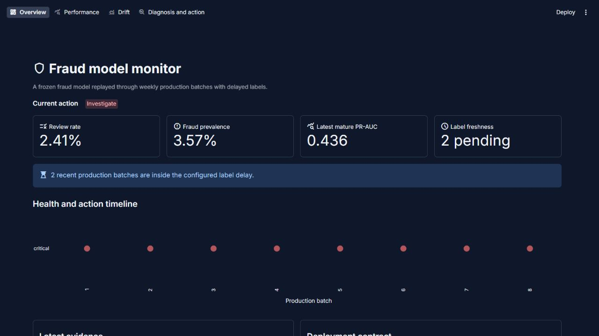
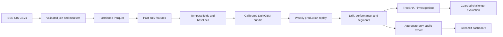

# Financial fraud detection and model monitoring

An offline-first, portfolio-grade machine-learning system that follows a fraud model from raw
IEEE-CIS files through temporal development, calibrated deployment, delayed-label production
replay, monitoring, diagnosis, and guarded retraining evaluation.

The repository keeps core logic in reusable Python modules. The Kaggle notebook is intentionally
thin, the public Streamlit app reads only precomputed aggregates, and all tests run without
competition data.



## Architecture



The chronological contract uses percentages of elapsed `TransactionDT`, not row quantiles:

| Elapsed range | Purpose | May fit model state? |
|---|---|---|
| 0–50% | Development and expanding temporal folds | Yes |
| 50–60% | Probability calibration and fixed thresholds | Calibrator and thresholds only |
| 60–70% | Locked acceptance and monitoring reference | No |
| 70–100% | Weekly simulated production | No; champion stays frozen |
| Later official test data | Unlabeled shadow stream | No |

Production labels mature after two seven-day batches. Until then, performance is explicitly
`unavailable`; missing labels never produce a false healthy state.

## Quick start

Python 3.12 and [uv](https://docs.astral.sh/uv/) are the reference environment.

```bash
uv sync --extra dev --extra train
uv run fraud-monitor show-config
uv run pytest
uv run streamlit run streamlit_app.py
```

The committed dashboard data under `artifacts/demo/` is the public-safe aggregate export from the
verified full IEEE-CIS run described below. It contains no transaction identifiers, row-level
records, model binary, or MLflow runtime data. Synthetic fixtures remain available only to tests.

## Full pipeline

Place the four [IEEE-CIS Fraud Detection](https://www.kaggle.com/c/ieee-fraud-detection/data)
files under `data/raw/`:

- `train_transaction.csv`
- `train_identity.csv`
- `test_transaction.csv`
- `test_identity.csv`

Then run:

```bash
uv run fraud-monitor prepare
uv run fraud-monitor train
uv run fraud-monitor replay --bundle artifacts/private/model/model_bundle.joblib
uv run fraud-monitor retrain-eval --bundle artifacts/private/model/model_bundle.joblib
uv run fraud-monitor build-demo \
  --review-budget artifacts/private/model/acceptance_review_budgets.parquet
```

For a lightweight pipeline check, use `uv run fraud-monitor train --quick --no-mlflow`.

Full-data execution is designed for [the Kaggle orchestration notebook](notebooks/kaggle_pipeline.ipynb).
It discovers attached competition files, installs this package, invokes the same CLI, and leaves
private artifacts in `/kaggle/working`.

## CLI reference

| Command | Responsibility | Principal outputs |
|---|---|---|
| `prepare` | Validate, join, profile, split, and convert data | Parquet tables and manifest |
| `train` | Compare baselines, tune LightGBM, calibrate, and evaluate once | `ModelBundle`, summary, review and reliability tables |
| `replay` | Score weekly production with delayed labels, then shadow traffic | Batch, drift, performance, segment, SHAP, and investigation tables |
| `retrain-eval` | Train a manual challenger on earlier matured history | Paired uncertainty, segment regression checks, recommendation |
| `build-demo` | Export only allow-listed aggregate columns | Public-safe dashboard artifacts |

Run `uv run fraud-monitor <command> --help` for command-specific options.

## Modeling and evaluation

- Dummy prior and compact one-hot logistic regression provide auditable baselines.
- Development uses expanding elapsed-time folds `1–2→3`, `1–3→4`, and `1–4→5`.
- Optuna compares constrained LightGBM trials with and without fold-local class weighting.
- Sigmoid and isotonic calibration are fitted only on the disjoint calibration period and selected
  by Brier score, expected calibration error, and a sigmoid tie-break.
- Thresholds for 0.5%, 1%, 2%, and 5% review capacity are frozen from calibration data. The
  deployed default is 2%.
- The acceptance report includes PR-AUC, ROC-AUC, operating-point metrics, error rates, captured
  fraud amount, calibration diagnostics, a reliability table, review-budget curves, bootstrap
  intervals, and paired PR-AUC uncertainty against logistic regression.
- Local SQLite-backed MLflow records parameters, hashes, fold metrics, champion metadata, and
  file artifacts without requiring a remote service.

### Verified full-data result

Kaggle notebook Version 5 completed on 2026-08-29 from repository commit `015c1f1`. The run used
data version `805c429ec247` and produced model version `fe47c8a821b3`.

| Locked-acceptance measure | Result |
|---|---:|
| Dummy prior PR-AUC | 0.0411 |
| Logistic regression PR-AUC | 0.1616 |
| LightGBM PR-AUC | 0.5826 (95% bootstrap CI 0.5638–0.6002) |
| Paired PR-AUC improvement over logistic | 0.4210 (95% bootstrap CI 0.4026–0.4380) |
| ROC-AUC | 0.9080 |
| Precision at the frozen default threshold | 0.7397 |
| Recall at the frozen default threshold | 0.4662 (95% bootstrap CI 0.4452–0.4851) |
| Captured fraud amount rate | 0.3008 |
| Brier score / expected calibration error | 0.0238 / 0.0015 |

Isotonic calibration was selected on the disjoint calibration window. The calibration-derived 2%
capacity threshold was 0.3657; applying that frozen score threshold to the later acceptance window
produced a 2.59% review rate. The selected LightGBM used 449 features, including 47 native
categoricals and two past-only frequency encodings. Mean temporal-fold PR-AUC was 0.6357 across the
three expanding folds.

## Monitoring and action policy

The locked acceptance period is the deployed reference. One-day blocks are resampled into
synthetic seven-day windows to derive warning (95th percentile) and critical (99th percentile)
limits, including the allowed simultaneous feature-alert count.

- Numeric drift: normalized Wasserstein distance and PSI.
- Categorical drift: Jensen–Shannon distance and unseen-category rate.
- Prediction drift: Jensen–Shannon score distance, score movement, and frozen-threshold capacity.
- Performance: PR-AUC, precision, recall, error rates, captured amount, prevalence, Brier score,
  and calibration error after labels mature.
- Data quality: schema, duplicates, volume, missingness, and identity coverage.
- Segments: product, card network/type, device, identity availability, purchaser email, and top
  address regions, with two-batch pooling and suppression for insufficient support.

Drift alone never replaces a model. Two consecutive mature PR-AUC or 2%-capacity recall breaches
request challenger evaluation. Replacement is recommended only when paired bootstrap evidence
shows a reliable PR-AUC improvement, recall is non-inferior, and no eligible segment has a reliable
recall regression.

The verified replay contains eight weekly production batches and 27 official-test shadow batches.
Six production batches have mature labels, the last two remain pending under the configured delay,
and every shadow batch correctly reports performance unavailable. Observed shifts caused 32
`investigate` states and three `retrain_evaluation_required` states. No challenger was run or model
replacement recommended automatically.

## Leakage safeguards

- Every transaction/identity join validates one-to-one cardinality and duplicate IDs.
- Official test time must begin strictly after labeled training time.
- Temporal partitions are disjoint and based on elapsed time.
- Category maps, frequency maps, dropped columns, causal state, models, calibrators, thresholds,
  and monitoring limits fit only on allowed earlier periods.
- Entity velocity features are calculated before state is updated; equal-timestamp rows cannot
  observe one another.
- `TransactionID` remains available for tracing but is excluded from model features and public
  artifacts.
- Shadow transforms do not require a target column.
- Model bundles persist their feature schema, causal aggregate state, calibration, thresholds,
  source-data version, model version, and temporal cutoffs.
- The challenger trains on earlier matured history and is evaluated on later untouched batches;
  it is never deployed automatically.

The tests include targeted leakage, category, calibration, delayed-label, drift-injection,
segment-support, replay, retraining, demo-export, and Streamlit page checks.

## Repository map

```text
src/fraud_monitor/   Data, features, modeling, monitoring, diagnostics, and contracts
notebooks/           Thin Kaggle orchestration notebook
configs/             Versioned runtime and simulation configuration
tests/               Unit, integration, leakage, and dashboard smoke tests
artifacts/demo/      Verified aggregate-only public dashboard data
app_pages/           Overview, performance, drift, and diagnosis pages
streamlit_app.py     Top-navigation Streamlit entry point
docs/                Architecture notes, experiment handoff, and interview notes
```

## Public deployment

For Streamlit Community Cloud, connect the public GitHub repository, choose `streamlit_app.py` as
the entry point, and use Python 3.12. Community Cloud detects `uv.lock`, and the dashboard
dependencies are part of the locked default environment. The app needs no secrets, raw
transactions, model binary, or live ML service.

## Reproducibility and data hygiene

- `uv.lock` pins the dependency graph; configuration and random seeds are versioned.
- Source hashes, schemas, row counts, missingness, target prevalence, and temporal bounds are
  captured in the preparation manifest.
- Raw CSVs, processed rows, credentials, model binaries, caches, and MLflow runtime directories
  are ignored by Git.
- Repeated runs with the same files, configuration, and seed reproduce partitions and materially
  equivalent metrics. Created-at timestamps and experiment run IDs are intentionally unique.

## Limitations

- `TransactionDT` is elapsed time, not a real timestamp, so outputs use elapsed days and batch IDs.
- IEEE-CIS identities and operational segments are anonymized; this project makes no protected-
  class fairness claim.
- Simulated weekly batches, review capacity, and 14-day labels are portfolio assumptions, not a
  live fraud-operations service-level agreement.
- The champion is a strong tabular baseline, not proof of production readiness. Investigation,
  cost modeling, reviewer feedback, governance approval, and live data contracts remain necessary.
- FastAPI, Docker, managed orchestration, live ingestion, a remote feature store, and automatic
  deployment are intentionally outside v1.

See [MODEL_CARD.md](MODEL_CARD.md), [architecture notes](docs/architecture.md), and the
[experiment handoff](docs/experiment_summary.md) for additional detail.
